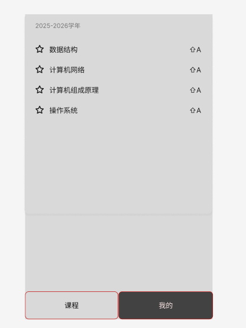
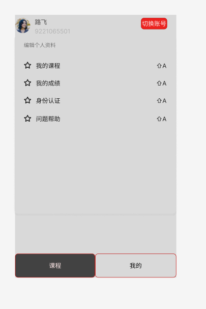
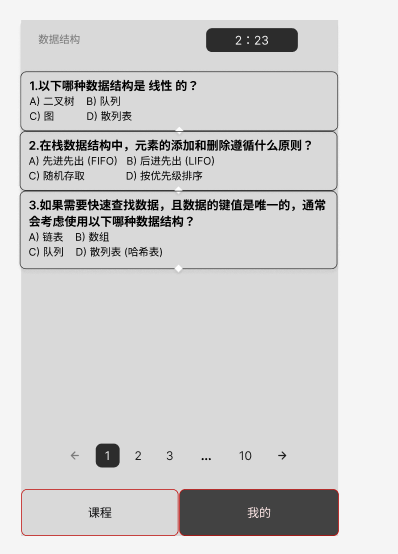

# 学生移动端界面初步设计

## 1. 项目概述

本设计文档描述了学生端移动界面的初步设计方案，涵盖主要页面、核心功能、接口需求及界面原型截图，旨在为后续开发提供参考。

---

## 2. 页面设计

### 2.1 课程页

* 展示当前学年学期及课程列表
* 每门课程可点击进入详情
* 支持课程收藏/取消收藏
* 课程列表分页显示

### 2.2 我的页

* 展示学生头像、姓名、学号
* 支持编辑个人资料
* 提供“切换账号”功能
* 菜单项包括：我的课程、我的成绩、身份认证、问题帮助

### 2.3 题目答题页

* 显示当前课程名称与倒计时
* 展示题目列表（单选题为主）
* 支持分页浏览题目

---

## 3. 功能设计

* 课程管理：查看、收藏、进入课程
* 个人信息管理：查看、编辑个人资料，切换账号
* 答题功能：在线答题，倒计时，分页切换
* 帮助与反馈：常见问题、身份认证等

---

## 4. 接口设计（示例）

| 接口名称     | 方法 | 路径              | 描述         | 请求参数     | 返回数据           |
| ------------ | ---- | ----------------- | ------------ | ------------ | ------------------ |
| 获取课程列表 | GET  | /api/courses      | 获取所有课程 | 学年、学期   | 课程数组           |
| 获取个人信息 | GET  | /api/user/profile | 获取学生信息 | token        | 头像、姓名、学号等 |
| 切换账号     | POST | /api/user/switch  | 切换登录账号 | 新账号信息   | 操作结果           |
| 获取题目列表 | GET  | /api/questions    | 获取课程题目 | 课程ID、页码 | 题目数组           |
| 提交答题结果 | POST | /api/answers      | 提交答题结果 | 题目ID、答案 | 操作结果           |

---

## 5. 界面原型截图

> 建议将图片放在 src/assets/ 目录下，以下为引用示例。

### 5.1 课程页

### 5.2 我的页

### 5.3 题目答题页

---

## 6. 后续优化方向

* 增加课程搜索与筛选功能
* 支持题目解析与错题本
* 优化移动端交互体验

---

今天的修改忘记提交拉取请求了，我今天的工作可以在code的这条记录查看[加入登录页面和个人页面优化首页 · teamwork10684/project_1@fe11a72](https://github.com/teamwork10684/project_1/commit/fe11a726c708212e123d6ad55d090a740a00596c)
